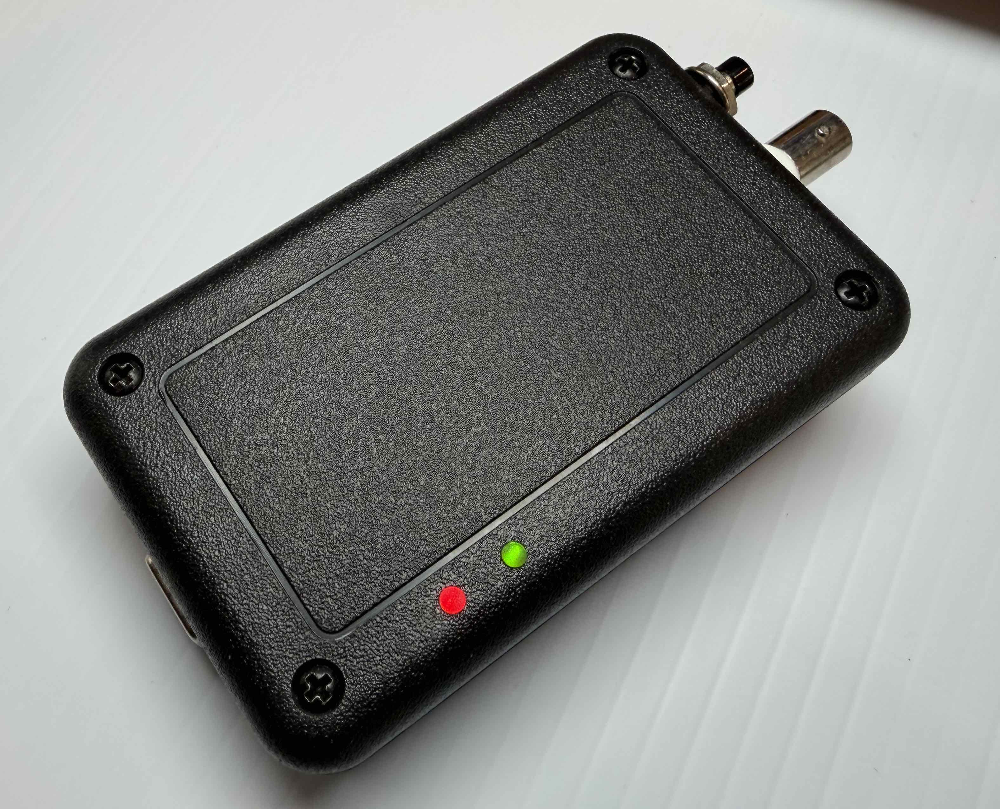

# SignalSlinger

SignalSlinger is an open-source 80-meter radio orienteering (ARDF) transmitter kit for the 3.5 MHz to 3.7 MHz amateur band. It supports classic, sprint, and foxoring events, with a high-accuracy real-time clock for synchronized transmissions and scheduled start and finish times.

## Product Photo

## Documentation

* [User Manual](https://docs.google.com/document/d/1eX7xH3cDyRNS-MVg13EojpP8IB8bDgrdszM48J0sn7k/edit?usp=sharing)
* [Bill of Material](https://docs.google.com/spreadsheets/d/182rCsEmR_KNoESYd0NLeVXOi867AKD0zTovbhvcYbqc/edit?usp=sharing)
* [GitHub Releases](https://github.com/OpenARDF/SignalSlinger/releases)

## Availability

SignalSlinger is planned to be available in kit form from [Backwoods Orienteering Klub](https://backwoodsok.org/). Please check the club website for current kit availability and pricing; if it is not listed there yet, it should be coming soon.

## Updating Software

This `Development2` branch currently carries the active development release line. Download the release file that matches your hardware revision:

* `SignalSlinger-v1.2.1-3.5.hex`
* `SignalSlinger-v1.2.1-3.4.hex`

Use an Atmel-ICE programmer over the board's UPDI programming header (`P101`) to install the firmware. Always choose the `.hex` file that matches your hardware revision, and do not modify fuses or disable UPDI.

For complete programming steps, avrdude examples, and hardware connection details, see the [User Manual](https://docs.google.com/document/d/1eX7xH3cDyRNS-MVg13EojpP8IB8bDgrdszM48J0sn7k/edit?usp=sharing). If you want the release files referenced from `main` instead, switch to that branch and use the downloads listed there.

## Firmware Development

Firmware source and build scripts live in [`Software/AVR128DA28`](Software/AVR128DA28).

For the current development workflow, start here:

* [`Software/AVR128DA28/CODEX_WORKFLOW.md`](Software/AVR128DA28/CODEX_WORKFLOW.md) for branch and patch-verification expectations
* [`Software/AVR128DA28/RELEASE_WORKFLOW.md`](Software/AVR128DA28/RELEASE_WORKFLOW.md) for release preparation and dual-target asset checks
* [`Software/AVR128DA28/build-firmware.ps1`](Software/AVR128DA28/build-firmware.ps1) for the standard local firmware build
* [`Software/AVR128DA28/verify-firmware-hashes.ps1`](Software/AVR128DA28/verify-firmware-hashes.ps1) for dual-target `.hex` build and SHA256 verification

## Related Projects

* [SignalStreamer](https://github.com/OpenARDF/SignalStreamer), a matching antenna
* [SignalSnagger](https://github.com/OpenARDF/SignalSnagger), a companion receiver project
* [SerialSlinger](https://github.com/OpenARDF/SerialSlinger), a serial terminal and logging companion for SignalSlinger configuration and monitoring
